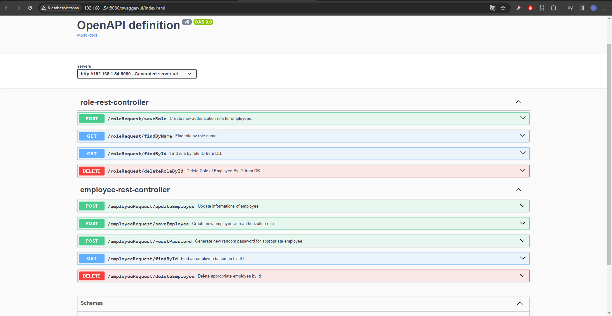
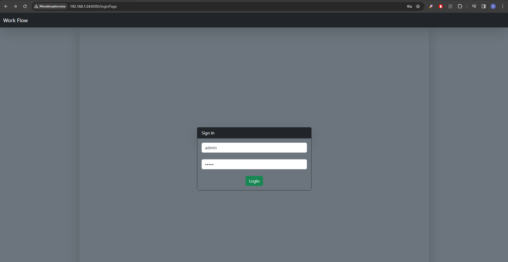
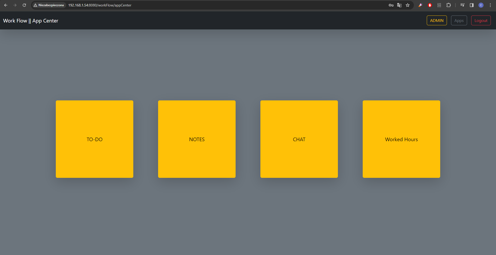
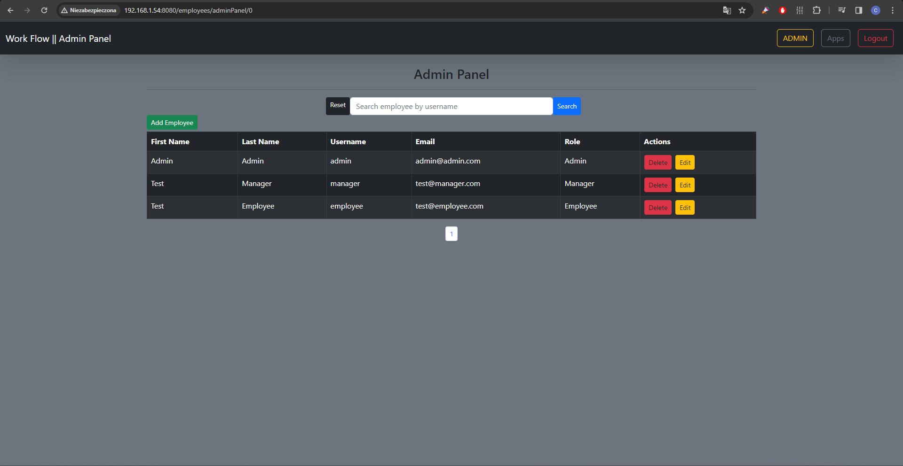
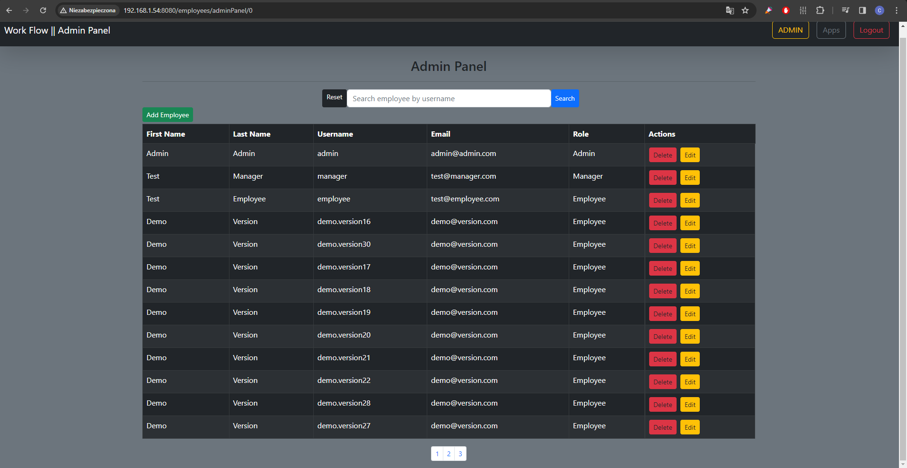
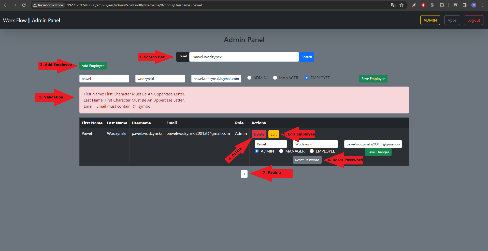

# Work_Flow

# Technology Stack

### Frontend:

- HTML
- CSS
- Bootstrap
- JavaScript

### Backend:

- Java

### Application Framework:

- Spring Boot

### Databases:

- MariaDB
- MySQL

### Libraries and Tools:

- Spring Boot Starter Data JPA
- Spring Boot Starter Security
- Spring Boot Starter Thymeleaf
- Thymeleaf Extras Spring Security 6
- Spring Boot DevTools (Development Only)
- Spring Boot Starter Validation
- Spring Boot Starter Web
- MySQL Connector/J
- Spring Boot Starter Test
- Spring Security Test
- MariaDB Java Client
- Spring Boot Starter for REST in Spring Data
- Java Mail Sender
- OpenAPI Swagger

# Project Overview

The project aims to consolidate the knowledge acquired thus far and serve as a platform for experimenting with new concepts and technologies. The primary technologies employed in this endeavor include Java as the programming language and Spring Boot as the application framework. The choice of databases encompasses both MariaDB and MySQL. Additionally, for the front-end development, HTML and JavaScript will be utilized to create dynamic and interactive user interfaces.

## Launch Description

1. **Cloning the Repository:**
    - Clone the repository from GitHub using the command:

      git clone https://github.com/PawelWodzynski/Work_Flow.git

2. **Database Configuration:**
    - Use the create-db.sql file located in the SQL-SCRIPTS folder in the project's root directory for your database setup.
      This file will provide you with the basic configuration for the project's database and ensure the proper functioning of the application.
        * To ensure smooth operation, a user must possess more than one role if their role is higher in hierarchy than ROLE_EMPLOYEE.
          Table 'employee' has a Many-To-Many relationship with Table 'role'.

    - Configure the database setup in the project located in the `application.properties` file to suit your needs.
      By default, the connection address is set to localhost:3306/workflow, and the default login is 'root' with the password 'root'.
      (You can find the application.properties file under 'Work_Flow/src/main/resources/application.properties' )

3. **Launching the Project:**
    - Open the project in your IDE.
    - Find the main application class (WorkFlowDemoApplication).
    - Run the application through the main class.
    - Now you can use the ready-made project at 'http://localhost:8080/loginPage'

## Swagger UI Documentation

**You can find Swagger UI endpoint documentation at http://localhost:8080/swagger-ui/index.html

## Project Features

1. ** Authentication **

- Upon entering the URL 'http://localhost:8080/loginPage', you will be redirected to the login page supported by Spring Security.
  By default, in the application starter, you can log in using the logins 'admin', 'manager', 'employee', and the universal password 'admin'.
  Each of these users (logins) is assigned an authentication role in sequence, 'admin' -> ROLE_ADMIN, 'manager' -> ROLE_MANAGER, 'employee' -> ROLE_EMPLOYEE.
  In this version of the application, we will focus on the ADMIN role, as it is the first version of the application that focuses on the User Management Panel.

2. ** App Center**

- After logging in with authentication credentials, you will be redirected to the main application panel, which is the App Center.
  In this version, it is exclusively a prototype of future application features, and we will focus on the ADMIN button in the top right corner of the screen, which will redirect us to the User Management Panel.

3. ** Admin Panel **

- Upon entering the URL accessible only to users with the ROLE_ADMIN role 'http://localhost:8080/employees/adminPanel',
  you will be presented with a list of all employees in the database, by default there are only three, but you can have many more.

4. ** Description of Admin Panel Functions **

- 1.Search Bar 
  Just above the list of all users in the center of the screen, you can see the Search Bar, in this field, you can search for a user by their username, which consists of their first and last name.
  The Reset Button is used to return to the first page of the list.
  You can both delete and edit the searched user on the list, the description of the user editing section can be found below in point 4.

- 2.Add Employee 
  Below the Search Bar on the right side, you can find the button to add users.
  When adding a user, a unique username will be automatically generated for them, consisting of their first and last name, and a BCrypt password will also be automatically randomly generated.
  The generated authentication data will be sent to the employee's email address provided during registration.
  The added user is appropriately validated, for more information about validation, you can see the Swagger UI documentation in the 'employee-rest-controller' section or in the java classes in the project package 'com.workflow.WorkFlowDEMO.api.utils.validation.employee.validators'

- 3.Validation 
  Adding/Editing users is properly validated.
  (for more information about validation, you can see the Swagger UI documentation in the 'employee-rest-controller' section or in the java classes in the project package 'com.workflow.WorkFlowDEMO.api.utils.validation.employee.validators')
  However, validation occurs asynchronously when adding a user, validation messages are displayed below the form, while in the case of editing information about validation, they are displayed in the form of a modal window.

- 4.Delete Employee 
  After clicking the Delete Button, the user will be deleted from the database, and the current page on which you are will be refreshed without this user.

- 5.Edit Employee 
  You can edit the searched user by clicking the Edit Button.
  After clicking the Edit Button, you will see the user editing form, after editing the employee, depending on whether you changed their first or last name, if so, a new unique username will be generated,
  which will be sent to the email address provided in the edit form.
  If you changed the user's role or email address, it will simply save the new settings for the employee in the database.
  Of course, you can edit everything about the employee at once.

- 6.Reset Password For Employee 
  Below the editing form, you can see the Reset Password Button.
  By clicking on this button, a new BCrypt password will be generated and saved in the database for this user.
  The newly generated password will be sent to the user's email address.
  However, information about the newly generated password is shown synchronously through a modal window.

- 7.Pagination of Users List (Paging) 
  At the very bottom of the page, you can see pages of users contained in the list, the more users, the proportionally more pages will increase.

### Main Application Objectives:

The application, primarily targeted at corporate entities, will begin as a web-based system with plans for a future desktop version. It seeks to offer the following key functionalities:

1. **User Management Panel:**
    - A comprehensive system for managing user roles, permissions, and access levels within the corporate environment.

2. **To-Do List Organization:**
    - Feature-rich task management facilitating efficient organization and tracking of tasks, both collaboratively within teams and individually.

3. **Notebook for Personal Thoughts:**
    - A dedicated space allowing users to record and organize their ideas, notes, and essential thoughts.

4. **Group and Private Chat:**
    - Real-time communication channels supporting both group discussions and private conversations, promoting effective team communication.

5. ** Scheduling and Work Hours Management:**
    - A scheduling system aiding in organizing work tasks and monitoring hours worked per month, contributing to better time management and workload distribution.

### Future Development:

These functionalities represent the planned roadmap for the application's features. Their implementation will require patience, as they constitute an extensive set of tools catering to diverse corporate needs. Future iterations will focus on transitioning from the web-based platform to a desktop application.

### Visual Prototype:
A visual prototype of the platform can be previewed [here](https://www.figma.com/file/odOdDSgzWptYUJmSC43The/WorkFlow?type=design&node-id=0%3A1&mode=design&t=kBviDvh6OBp9ZviP-1).

This comprehensive suite of features aims to provide a robust and versatile solution for corporate entities, enhancing productivity, collaboration, and organization within the work environment.

.